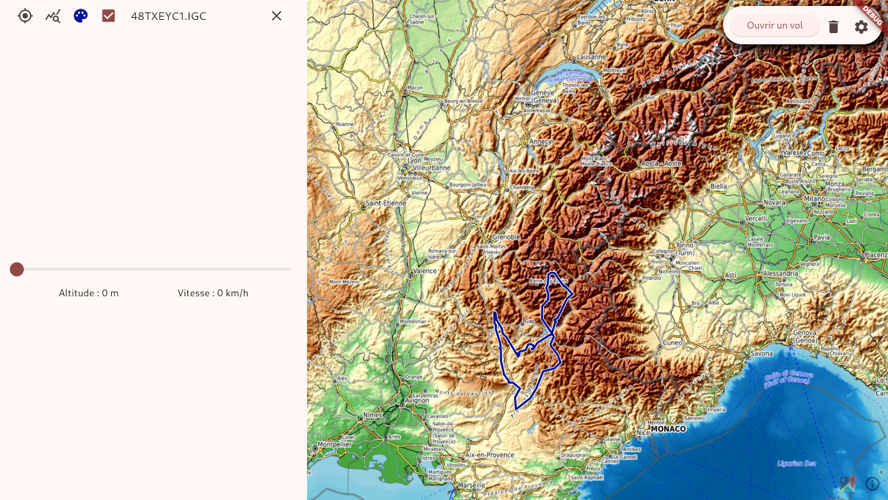
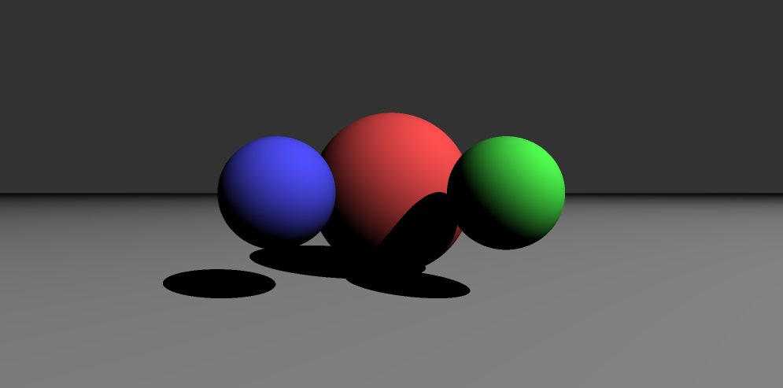

### Hi there 👋
I'm Hugo Berthet-Rambaud, an Engineering computer science student at INSA Lyon.

You will find here my trials and errors, solutions to various problems. There is also some fun stuff (like [Cnake](https://github.com/hugo-b-r/Cnake)) ! When I have a new idea, or learn something that could be useful, I try to apply it to these projecs !
I am currently building a voxel like or Minecraft Like game and learning a lot of stuff ! 
[Gliss](https///github.com/hugo-b-r/Gliss)   | [RaytraCer](https://github.com/hugo-b-r/Raytracer)  |  [Cnake](https://github.com/hugo-b-r/Cnake)
:------------------------------------------:|:---------------------------------------------------:|:-------------------------------------------:
            |                     |    

